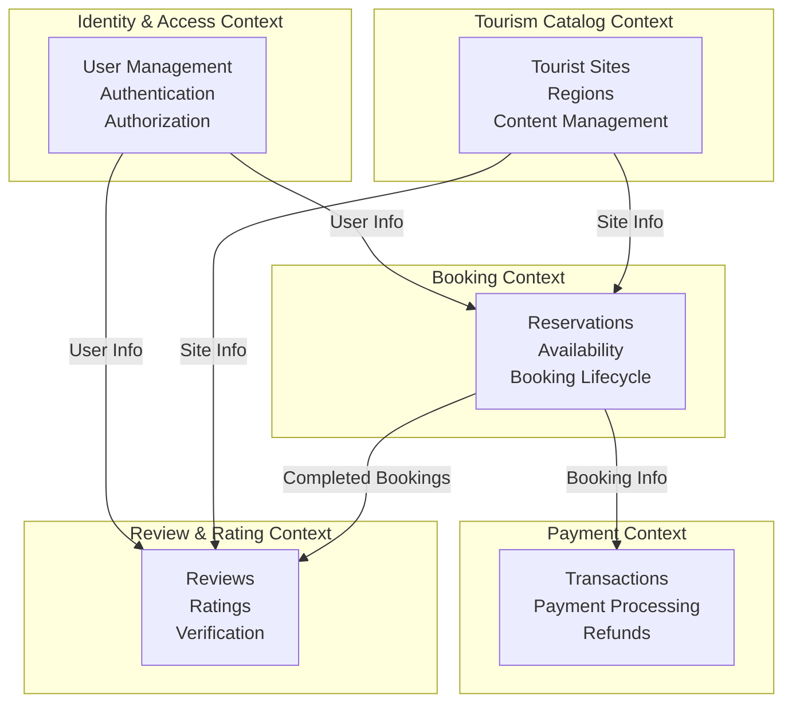

# Domain-Driven Design Refactoring Plan for NaTourCam

## Executive Summary

Yes, this project **can be refactored** to adopt Domain-Driven Design (DDD) methodology. However, it requires significant architectural changes and a phased migration approach. This document outlines a comprehensive strategy for transforming the current Django MTV architecture into a DDD-based system.

## Current State Analysis

### Existing Architecture
- **Pattern**: Traditional Django MTV (Model-Template-View)
- **Data Access**: Direct ORM usage throughout views
- **Business Logic**: Scattered across views and serializers
- **Structure**: Technical separation (models, views, serializers)

### Key Applications
1. **Accounts** - User management and authentication
2. **Bookings** - Booking, payment, and review management
3. **Tourism** - Tourist sites, regions, and content management

## Proposed DDD Architecture

### 1. Identified Bounded Contexts



### 2. Ubiquitous Language

#### Identity & Access Context
- **User** - A person who interacts with the system
- **Credential** - Authentication information
- **Role** - Permission set (Tourist, Admin)
- **Profile** - User personal information

#### Tourism Catalog Context
- **TouristDestination** - A place of interest (renamed from TouristSite)
- **Region** - Geographic area containing destinations
- **DestinationContent** - Multilingual information about a destination
- **VisitingHours** - Operating schedule
- **AdmissionFee** - Cost to enter

#### Booking Context
- **Reservation** - A confirmed booking for a destination
- **BookingRequest** - Initial request to book
- **VisitorGroup** - Number and type of visitors
- **BookingStatus** - Lifecycle state (Pending, Confirmed, Cancelled, Completed)
- **TimeSlot** - Available booking period

#### Payment Context
- **Transaction** - Financial exchange
- **PaymentMethod** - How payment is made
- **PaymentStatus** - Transaction state
- **Refund** - Money returned to customer

#### Review & Rating Context
- **Review** - User feedback about a destination
- **Rating** - Numerical score (1-5 stars)
- **VerifiedReview** - Review from confirmed visitor

### 3. Aggregate Design

#### Identity & Access Context

**User Aggregate**
```
User (Aggregate Root)
├── UserId (Value Object)
├── Email (Value Object)
├── PhoneNumber (Value Object)
├── UserProfile (Entity)
│   ├── DateOfBirth
│   ├── Language
│   └── VerificationStatus
└── Credentials (Value Object)
```

#### Tourism Catalog Context

**TouristDestination Aggregate**
```
TouristDestination (Aggregate Root)
├── DestinationId (Value Object)
├── Name (Value Object)
├── Description
├── Location (Value Object)
│   ├── Latitude
│   ├── Longitude
│   └── Address
├── Region (Entity Reference)
├── VisitingHours (Value Object)
├── AdmissionFee (Value Object - Money)
├── Images (Collection of Value Objects)
└── BilingualContent (Collection of Entities)
```

**Region Aggregate**
```
Region (Aggregate Root)
├── RegionId (Value Object)
├── Name
├── Code
└── Description
```

#### Booking Context

**Reservation Aggregate**
```
Reservation (Aggregate Root)
├── ReservationId (Value Object)
├── UserId (Value Object - Reference)
├── DestinationId (Value Object - Reference)
├── BookingDate (Value Object)
├── VisitorGroup (Value Object)
│   └── NumberOfVisitors
├── TotalPrice (Value Object - Money)
├── Status (Value Object - BookingStatus)
├── SpecialRequests
└── BookingHistory (Collection of Domain Events)

Domain Events:
- ReservationCreated
- ReservationConfirmed
- ReservationCancelled
- ReservationCompleted
```

#### Payment Context

**Transaction Aggregate**
```
Transaction (Aggregate Root)
├── TransactionId (Value Object)
├── ReservationId (Value Object - Reference)
├── Amount (Value Object - Money)
├── PaymentMethod (Value Object)
├── Status (Value Object - PaymentStatus)
└── ProcessedAt

Domain Events:
- PaymentInitiated
- PaymentCompleted
- PaymentFailed
- RefundIssued
```

#### Review & Rating Context

**Review Aggregate**
```
Review (Aggregate Root)
├── ReviewId (Value Object)
├── UserId (Value Object - Reference)
├── DestinationId (Value Object - Reference)
├── Rating (Value Object - StarRating)
├── Comment
├── VerificationStatus (Value Object)
└── CreatedAt

Domain Events:
- ReviewSubmitted
- ReviewVerified
- ReviewUpdated
```

### 4. Proposed Directory Structure

```
Backend/
├── manage.py
├── natourcam/              # Django project settings
│   ├── settings.py
│   └── urls.py
│
├── shared/                 # Shared Kernel
│   ├── domain/
│   │   ├── value_objects.py    # Money, Email, PhoneNumber, etc.
│   │   └── base.py             # Base classes for entities, aggregates
│   └── infrastructure/
│       └── django_base.py      # Django-specific base classes
│
├── identity_access/        # Identity & Access Bounded Context
│   ├── domain/
│   │   ├── model/
│   │   │   ├── user.py             # User aggregate
│   │   │   ├── value_objects.py    # UserId, Email, etc.
│   │   │   └── events.py           # Domain events
│   │   ├── repositories.py         # Repository interfaces
│   │   └── services.py             # Domain services
│   ├── application/
│   │   ├── commands.py             # Command handlers
│   │   ├── queries.py              # Query handlers
│   │   └── services.py             # Application services
│   ├── infrastructure/
│   │   ├── models.py               # Django ORM models
│   │   ├── repositories.py         # Repository implementations
│   │   └── serializers.py          # DRF serializers
│   └── presentation/
│       ├── views.py                # API views
│       └── urls.py
│
├── tourism_catalog/        # Tourism Catalog Bounded Context
│   ├── domain/
│   │   ├── model/
│   │   │   ├── destination.py      # TouristDestination aggregate
│   │   │   ├── region.py           # Region aggregate
│   │   │   ├── value_objects.py    # Location, Money, etc.
│   │   │   └── events.py
│   │   ├── repositories.py
│   │   └── services.py
│   ├── application/
│   │   ├── commands.py
│   │   ├── queries.py
│   │   └── services.py
│   ├── infrastructure/
│   │   ├── models.py
│   │   ├── repositories.py
│   │   └── serializers.py
│   └── presentation/
│       ├── views.py
│       └── urls.py
│
├── booking/                # Booking Bounded Context
│   ├── domain/
│   │   ├── model/
│   │   │   ├── reservation.py      # Reservation aggregate
│   │   │   ├── value_objects.py    # BookingStatus, VisitorGroup
│   │   │   └── events.py
│   │   ├── repositories.py
│   │   └── services.py             # Availability checking, pricing
│   ├── application/
│   │   ├── commands.py
│   │   ├── queries.py
│   │   └── services.py
│   ├── infrastructure/
│   │   ├── models.py
│   │   ├── repositories.py
│   │   └── serializers.py
│   └── presentation/
│       ├── views.py
│       └── urls.py
│
├── payment/                # Payment Bounded Context
│   ├── domain/
│   │   ├── model/
│   │   │   ├── transaction.py      # Transaction aggregate
│   │   │   ├── value_objects.py    # PaymentMethod, PaymentStatus
│   │   │   └── events.py
│   │   ├── repositories.py
│   │   └── services.py             # Payment processing
│   ├── application/
│   │   ├── commands.py
│   │   ├── queries.py
│   │   └── services.py
│   ├── infrastructure/
│   │   ├── models.py
│   │   ├── repositories.py
│   │   ├── serializers.py
│   │   └── payment_gateway.py      # External payment integration
│   └── presentation/
│       ├── views.py
│       └── urls.py
│
└── review/                 # Review & Rating Bounded Context
    ├── domain/
    │   ├── model/
    │   │   ├── review.py           # Review aggregate
    │   │   ├── value_objects.py    # StarRating, VerificationStatus
    │   │   └── events.py
    │   ├── repositories.py
    │   └── services.py
    ├── application/
    │   ├── commands.py
    │   ├── queries.py
    │   └── services.py
    ├── infrastructure/
    │   ├── models.py
    │   ├── repositories.py
    │   └── serializers.py
    └── presentation/
        ├── views.py
        └── urls.py
```

### 5. Key DDD Patterns to Implement

#### Repository Pattern
```python
# Domain layer - Interface
class IReservationRepository(ABC):
    @abstractmethod
    def get_by_id(self, reservation_id: ReservationId) -> Optional[Reservation]:
        pass
    
    @abstractmethod
    def save(self, reservation: Reservation) -> None:
        pass
    
    @abstractmethod
    def find_by_user(self, user_id: UserId) -> List[Reservation]:
        pass

# Infrastructure layer - Implementation
class DjangoReservationRepository(IReservationRepository):
    def get_by_id(self, reservation_id: ReservationId) -> Optional[Reservation]:
        try:
            booking_model = BookingModel.objects.get(id=reservation_id.value)
            return self._to_domain(booking_model)
        except BookingModel.DoesNotExist:
            return None
```

#### Value Objects
```python
@dataclass(frozen=True)
class Money:
    amount: Decimal
    currency: str = "XAF"  # Central African CFA franc
    
    def __post_init__(self):
        if self.amount < 0:
            raise ValueError("Amount cannot be negative")
    
    def add(self, other: 'Money') -> 'Money':
        if self.currency != other.currency:
            raise ValueError("Cannot add different currencies")
        return Money(self.amount + other.amount, self.currency)

@dataclass(frozen=True)
class Email:
    value: str
    
    def __post_init__(self):
        if not self._is_valid(self.value):
            raise ValueError(f"Invalid email: {self.value}")
    
    @staticmethod
    def _is_valid(email: str) -> bool:
        # Email validation logic
        return "@" in email and "." in email.split("@")[1]
```

#### Domain Services
```python
class BookingPricingService:
    """Domain service for calculating booking prices"""
    
    def calculate_total_price(
        self,
        destination: TouristDestination,
        visitor_group: VisitorGroup,
        booking_date: BookingDate
    ) -> Money:
        base_price = destination.admission_fee
        total = base_price.multiply(visitor_group.number_of_visitors)
        
        # Apply seasonal pricing
        if self._is_peak_season(booking_date):
            total = total.multiply(Decimal("1.2"))
        
        return total
    
    def _is_peak_season(self, date: BookingDate) -> bool:
        # Business logic for peak season
        return date.month in [12, 1, 7, 8]
```

#### Application Services (Use Cases)
```python
class CreateReservationCommand:
    user_id: str
    destination_id: str
    booking_date: date
    number_of_visitors: int
    special_requests: str

class CreateReservationHandler:
    def __init__(
        self,
        reservation_repo: IReservationRepository,
        destination_repo: IDestinationRepository,
        pricing_service: BookingPricingService,
        event_bus: IEventBus
    ):
        self._reservation_repo = reservation_repo
        self._destination_repo = destination_repo
        self._pricing_service = pricing_service
        self._event_bus = event_bus
    
    def handle(self, command: CreateReservationCommand) -> ReservationId:
        # Load destination
        destination = self._destination_repo.get_by_id(
            DestinationId(command.destination_id)
        )
        if not destination:
            raise DestinationNotFoundError()
        
        # Create value objects
        user_id = UserId(command.user_id)
        booking_date = BookingDate(command.booking_date)
        visitor_group = VisitorGroup(command.number_of_visitors)
        
        # Calculate price using domain service
        total_price = self._pricing_service.calculate_total_price(
            destination, visitor_group, booking_date
        )
        
        # Create reservation aggregate
        reservation = Reservation.create(
            user_id=user_id,
            destination_id=destination.id,
            booking_date=booking_date,
            visitor_group=visitor_group,
            total_price=total_price,
            special_requests=command.special_requests
        )
        
        # Save
        self._reservation_repo.save(reservation)
        
        # Publish domain events
        for event in reservation.domain_events:
            self._event_bus.publish(event)
        
        return reservation.id
```

#### Domain Events
```python
@dataclass(frozen=True)
class ReservationCreated:
    reservation_id: ReservationId
    user_id: UserId
    destination_id: DestinationId
    booking_date: BookingDate
    total_price: Money
    occurred_at: datetime

class ReservationCreatedHandler:
    """Event handler that triggers payment initiation"""
    
    def __init__(self, payment_service: PaymentApplicationService):
        self._payment_service = payment_service
    
    def handle(self, event: ReservationCreated):
        # Initiate payment process
        self._payment_service.initiate_payment(
            reservation_id=event.reservation_id,
            amount=event.total_price
        )
```

## Migration Strategy

### Phase 1: Foundation (Weeks 1-2)
- [ ] Create shared kernel with base classes and common value objects
- [ ] Set up new directory structure alongside existing code
- [ ] Implement basic repository pattern for one bounded context (start with Tourism Catalog)
- [ ] Create value objects for Money, Email, Location
- [ ] Write unit tests for value objects

### Phase 2: Tourism Catalog Context (Weeks 3-4)
- [ ] Implement TouristDestination aggregate with business logic
- [ ] Create repository interfaces and implementations
- [ ] Implement application services (commands and queries)
- [ ] Migrate existing tourism views to use new application services
- [ ] Keep old models running in parallel for data migration

### Phase 3: Identity & Access Context (Weeks 5-6)
- [ ] Implement User aggregate
- [ ] Create authentication domain services
- [ ] Implement repository pattern for users
- [ ] Migrate authentication logic to application services
- [ ] Update API endpoints to use new services

### Phase 4: Booking Context (Weeks 7-9)
- [ ] Implement Reservation aggregate with business rules
- [ ] Create BookingPricingService domain service
- [ ] Implement availability checking logic
- [ ] Add domain events for reservation lifecycle
- [ ] Create event handlers
- [ ] Migrate booking endpoints

### Phase 5: Payment Context (Weeks 10-11)
- [ ] Implement Transaction aggregate
- [ ] Create payment processing domain services
- [ ] Implement payment gateway integration in infrastructure layer
- [ ] Add domain events for payment lifecycle
- [ ] Migrate payment endpoints

### Phase 6: Review Context (Weeks 12-13)
- [ ] Implement Review aggregate
- [ ] Create review verification domain logic
- [ ] Implement repository and application services
- [ ] Migrate review endpoints

### Phase 7: Integration & Testing (Weeks 14-15)
- [ ] Implement event bus for cross-context communication
- [ ] Set up integration tests for all bounded contexts
- [ ] Test end-to-end workflows
- [ ] Performance testing and optimization

### Phase 8: Data Migration & Cleanup (Weeks 16-17)
- [ ] Migrate all data from old models to new structure
- [ ] Remove old Django apps (accounts, bookings, tourism)
- [ ] Update all API documentation
- [ ] Final testing and validation

### Phase 9: Deployment (Week 18)
- [ ] Deploy to staging environment
- [ ] User acceptance testing
- [ ] Deploy to production
- [ ] Monitor and fix issues

## Benefits of DDD Refactoring

### 1. **Better Business Alignment**
- Code reflects business language and concepts
- Easier communication between developers and domain experts
- Business rules are explicit and centralized

### 2. **Improved Maintainability**
- Clear separation of concerns
- Business logic isolated from infrastructure
- Easier to test and modify

### 3. **Scalability**
- Bounded contexts can be scaled independently
- Easier to split into microservices later
- Clear boundaries reduce coupling

### 4. **Flexibility**
- Easy to change infrastructure (database, frameworks)
- Business logic remains stable
- Can add new features without breaking existing code

### 5. **Better Testing**
- Domain logic can be tested without database
- Clear interfaces make mocking easier
- Integration tests focus on boundaries

## Challenges & Considerations

### 1. **Learning Curve**
- Team needs to understand DDD concepts
- More upfront design required
- Different mindset from traditional Django development

### 2. **Initial Complexity**
- More files and layers
- More boilerplate code initially
- Requires discipline to maintain structure

### 3. **Django Integration**
- Django is designed for MTV pattern
- Need to work around Django's assumptions
- ORM models become infrastructure detail

### 4. **Migration Risk**
- Running two architectures in parallel
- Data migration complexity
- Potential for bugs during transition

### 5. **Time Investment**
- Significant refactoring effort required
- Business feature development may slow down
- Need stakeholder buy-in

## Recommendations

### Should You Refactor to DDD?

**YES, if:**
- ✅ Project will grow significantly in complexity
- ✅ Business rules are complex and changing frequently
- ✅ Team is willing to invest in learning DDD
- ✅ Long-term maintainability is priority
- ✅ Planning to scale or split into microservices

**NO, if:**
- ❌ Project is simple CRUD with minimal business logic
- ❌ Team is small and unfamiliar with DDD
- ❌ Need to deliver features quickly in short term
- ❌ Project is near end of life
- ❌ Budget/time constraints are tight

### For NaTourCam Specifically

**Recommendation: YES, with phased approach**

This project has:
- ✅ Clear business domains (tourism, booking, payment)
- ✅ Complex business rules (pricing, availability, verification)
- ✅ Potential for growth and new features
- ✅ Multiple bounded contexts that could benefit from isolation

**Suggested Approach:**
1. Start with **Tourism Catalog** context (lowest risk, highest value)
2. Implement **Booking** context next (most complex business logic)
3. Continue with other contexts based on priority
4. Keep existing code running during migration
5. Migrate incrementally, one endpoint at a time

## Next Steps

1. **Review this plan** with the development team
2. **Get stakeholder approval** for the refactoring effort
3. **Set up training** on DDD concepts and patterns
4. **Create proof of concept** with Tourism Catalog context
5. **Establish coding standards** for DDD implementation
6. **Begin Phase 1** of migration strategy

## Resources

- **Books**: "Domain-Driven Design" by Eric Evans, "Implementing Domain-Driven Design" by Vaughn Vernon
- **Python DDD**: Look into libraries like `eventsourcing`, `dry-python`
- **Django + DDD**: Research existing patterns and examples
- **Architecture**: Study hexagonal architecture and clean architecture patterns
